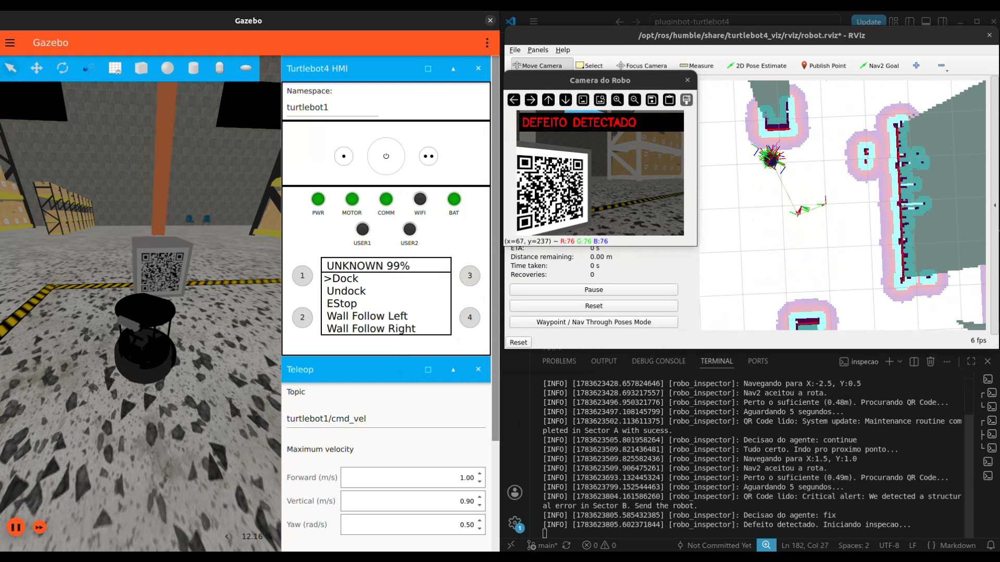
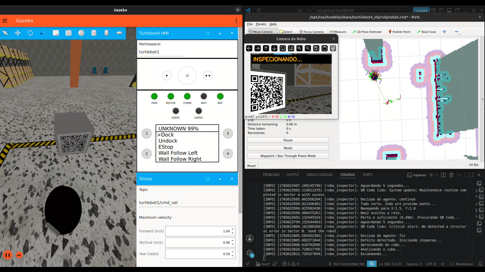
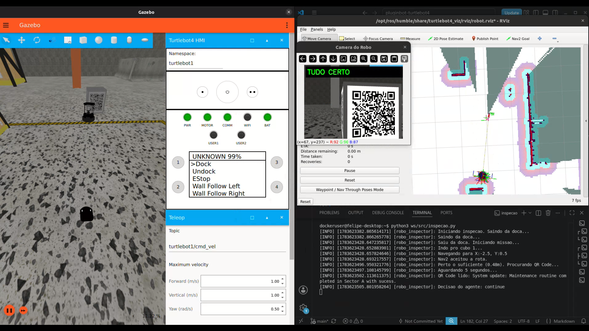

# Pluginbot - TurtleBot4: Inspeção com Agente Autônomo

## Sistema de inspeção de qualidade com visão computacional e Ollama no TurtleBot4

---

## Vídeo de Apresentação

<a href="https://www.youtube.com/watch?v=ztenR9NqbO8" target="_blank">
   Pluginbot - Vídeo de Apresentação
</a>

---





---

# Estrutura do Projeto

- `inspecao.py`: Ponto de entrada do sistema. Cria o nó ROS 2, define a rota de inspeção, conecta a navegação e a câmera, e executa o scan lateral quando precisa inspecionar um cubo.
- `navegacao.py`: Módulo de navegação. Cuida de enviar o robô pros waypoints usando o Nav2 e de voltar pra doca no final.
- `camera.py`: Módulo de câmera. Lê as imagens da câmera do robô, detecta QR Codes com OpenCV e manda os dados pro agente decidir.
- `agente.py`: O "inspetor de qualidade" do sistema. Se comunica com o Ollama, interpreta o texto dos QR Codes e decide se o robô deve continuar a rota ou realizar um conserto, retornando a ação em JSON.
- `cubos.sdf`: Modelo customizado para o Gazebo contendo 2 cubos com a textura de um QR Code de teste, servindo como ponto de inspeção.
- `nav2.yaml`: Parâmetros do Nav2 e configuração de mapa/sensores para garantir a navegação autônoma e desvio de obstáculos.
- `Dockerfile`: Container com ROS 2, ferramentas de simulação (Ignition/Gazebo), bibliotecas de visão computacional e Ollama integrado.

---

# Como rodar

## 1. Clonar o repositório e acessar a pasta

```bash
git clone https://github.com/vvvvvdal/pluginbot-turtlebot4.git
cd pluginbot-turtlebot4/
```

---

## 2. Configuração NVIDIA e Permissões Gráficas

Siga as instruções oficiais para instalar o `nvidia-container-toolkit` se não estiver configurado. Após isso, libere a interface gráfica do host para o Docker:

### Adicionar chave do repositório NVIDIA

```bash
curl -fsSL https://nvidia.github.io/libnvidia-container/gpgkey | sudo gpg --dearmor -o /usr/share/keyrings/nvidia-container-toolkit-keyring.gpg \
  && curl -s -L https://nvidia.github.io/libnvidia-container/stable/deb/nvidia-container-toolkit.list | \
    sed 's#deb https://#deb [signed-by=/usr/share/keyrings/nvidia-container-toolkit-keyring.gpg] https://#g' | \
    sudo tee /etc/apt/sources.list.d/nvidia-container-toolkit.list
```

### Instalar NVIDIA Container Toolkit

```bash
sudo apt-get update
sudo apt-get install -y nvidia-container-toolkit
```

### Configurar runtime NVIDIA no Docker

```bash
sudo nvidia-ctk runtime configure --runtime=docker
```

### Gerar arquivo CDI

```bash
sudo nvidia-ctk cdi generate --output=/etc/cdi/nvidia.yaml
```

### Reiniciar Docker

```bash
sudo systemctl restart docker
```

### Liberar interface gráfica

```bash
xhost +local:docker
```

---

## 3. Buildar o Container

```bash
docker build -t tb4_inspecao .
```

---

# Fluxo de Execução

O projeto pode ser executado em duas modalidades: simulado no Gazebo ou no robô físico real. O Ollama precisa estar rodando na máquina host em ambas as opções.

---

## Parte 1: Rodando na Simulação (Gazebo)

### Terminal 1: Subir o Cérebro (Ollama com modelo llama3.2:1b)

Inicializa o serviço do Ollama em background e carrega o modelo de IA leve na memória.

```bash
# Inicia o servidor em background
ollama serve > /dev/null 2>&1 &

# Carrega o modelo
ollama run llama3.2:1b
```

*(Você pode fechar o prompt do modelo com `Ctrl+d` após ele iniciar, o servidor continuará rodando na porta 11434).*

---

### Terminal 2 e 3: Gazebo

Inicializa o TurtleBot4 no ambiente de simulação e carrega a parede com o QR Code.

```bash
docker run --rm -it \
  --gpus all \
  --name tb4_inspecao \
  --env="DISPLAY=$DISPLAY" \
  --env="QT_X11_NO_MITSHM=1" \
  --volume="/tmp/.X11-unix:/tmp/.X11-unix:rw" \
  --volume="$(pwd):/home/dockeruser/ws" \
  --network=host \
  tb4_inspecao

cd ws
colcon build --symlink-install
source install/setup.bash
ros2 launch turtlebot4_ignition_bringup turtlebot4_ignition.launch.py world:=warehouse namespace:=turtlebot1
```

```bash
# Terminal 3: Spawnar os cubos
docker exec -it tb4_inspecao bash

ros2 run ros_gz_sim create -file /home/dockeruser/ws/src/cubos.sdf -x 0.0 -y 0.0 -z 0.0
```

---

### Terminal 4 e 5: SLAM e Nav2

Inicializa os sistemas de localização e navegação autônoma utilizando os parâmetros locais.

```bash
# Terminal 4: SLAM
docker exec -it tb4_inspecao bash

ros2 launch turtlebot4_navigation slam.launch.py sync:=true namespace:=turtlebot1

# Terminal 5: Nav2
docker exec -it tb4_inspecao bash

ros2 launch turtlebot4_navigation nav2.launch.py \
namespace:=turtlebot1 \
params_file:=/home/dockeruser/ws/src/nav2.yaml \
cmd_vel:=/turtlebot1/cmd_vel
```

---

### Terminal 6: RViz2

Interface gráfica para visualização do mapa, posição da parede e feedback visual do robô.
*Fixed Frame:* `turtlebot1/map`

```bash
docker exec -it tb4_inspecao bash

ros2 launch turtlebot4_viz view_robot.launch.py namespace:=turtlebot1
```

---

### Terminal 7: Iniciar a Inspeção

Roda o sistema de inspeção autônoma. O `inspecao.py` é o ponto de entrada que conecta os módulos de navegação (`navegacao.py`) e câmera (`camera.py`):

* Navega autonomamente pelos pontos da rota (Cubo A e Cubo B).
* Ao chegar no ponto, gira devagar até localizar e decodificar o QR Code.
* Envia os dados para o agente Ollama e executa um scan lateral de inspeção se a IA retornar a ação 'fix'.
* Ao final da rota, volta automaticamente para a doca.

```bash
docker exec -it tb4_inspecao bash

python3 ws/src/inspecao.py
```

---

## Parte 2: Rodando no Robô Físico Real

Para rodar no mundo real, **não** é necessário o simulador Gazebo nem o Docker. O código já está adaptado para funcionar direto no TurtleBot4 físico. O Ollama deve estar rodando na máquina host (igual à Parte 1).

---

### Passo 1: Preparar o Ambiente Físico

1. Imprima os QR Codes que estão na pasta `src/qrcode/` (ou crie novos QR Codes).
2. Cole os QR Codes em caixas, paredes ou objetos no ambiente real.
3. No arquivo `src/inspecao.py`, edite as coordenadas da variável `ROTA` com os pontos reais `(x, y)` em metros, mapeados nos próximos passos.

---

### Passo 2: Conectar ao TurtleBot4 via SSH


> Substitua `<IP_DO_ROBO>` pelo IP real do TurtleBot4 na rede (ex: `192.168.186.3`).
> O namespace padrão do robô físico geralmente é `turtlebot4` (confirme com `ros2 topic list` após conectar).

```bash
# No PC host:
ssh ubuntu@<IP_DO_ROBO>
# senha padrão: turtlebot4
```

---

### Passo 3: SLAM (Gerar o Mapa do Ambiente)

Execute os comandos abaixo para iniciar o mapeamento com SLAM Toolbox.

```bash
# Terminal 1: dentro do SSH (no robô):
ros2 launch turtlebot4_navigation slam.launch.py namespace:=turtlebot4
```

```bash
# Terminal 2: no PC, para controlar o robô (teleoperação pelo teclado):
ros2 run teleop_twist_keyboard teleop_twist_keyboard --ros-args -r __ns:=/turtlebot4
```

> Use as teclas `i` (frente), `,` (ré), `j` / `l` (girar) para explorar o ambiente e gerar o mapa.

```bash
# Terminal 3: no PC, para visualizar o mapa em tempo real (RViz2):
ros2 launch turtlebot4_viz view_robot.launch.py namespace:=turtlebot4
```

*Fixed Frame no RViz2: `turtlebot4/map`*

---

### Passo 4: Salvar o Mapa

Quando o mapa estiver completo, salve-o antes de encerrar o SLAM.

```bash
# Terminal 4: no PC:
ros2 run nav2_map_server map_saver_cli -f ~/mapa_inspecao \
  --ros-args -p map_subscribe_transient_local:=true -r __ns:=/turtlebot4
```

Isso vai gerar dois arquivos: `mapa_inspecao.pgm` e `mapa_inspecao.yaml`.

---

### Passo 5: Nav2 — Iniciar a Navegação Autônoma

Com o mapa salvo, reinicie os terminais e suba o Nav2 com o mapa gerado.

```bash
# Terminal 1: dentro do SSH (no robô):
ros2 launch turtlebot4_navigation localization.launch.py \
  map:=~/mapa_inspecao.yaml namespace:=turtlebot4
```

```bash
# Terminal 2: dentro do SSH (no robô), em outra sessão SSH:
ssh ubuntu@<IP_DO_ROBO>
ros2 launch turtlebot4_navigation nav2.launch.py namespace:=turtlebot4
```

```bash
# Terminal 3: no PC (RViz2 para definir a pose inicial):
ros2 launch turtlebot4_viz view_robot.launch.py namespace:=turtlebot4
```

> No RViz2, use a ferramenta **"2D Pose Estimate"** para clicar no mapa e indicar a posição e direção aproximada onde o robô está fisicamente. Isso é necessário porque o Nav2 não sabe onde o robô está ao iniciar.

---

### Passo 6: Iniciar a Inspeção Real

Com SLAM/Nav2 rodando e o robô localizado no mapa, execute o script de inspeção **no PC host** (não no SSH). O `use_sim_time:=false` garante que o ROS 2 use o relógio real, e não o da simulação.

```bash
# No PC (fora do Docker e do SSH):
cd ~/pluginbot-turtlebot4
source /opt/ros/humble/setup.bash

python3 src/inspecao.py --ros-args -p use_sim_time:=false -p namespace:=turtlebot4
```

O robô irá:
1. Iniciar saindo automaticamente da doca.
2. Navegar autonomamente pelos waypoints da `ROTA` configurada.
3. Ao chegar em cada ponto, girar devagar até localizar e decodificar o QR Code pela câmera.
4. Enviar os dados ao agente Ollama e executar o scan lateral se a IA retornar `'fix'`.
5. Ao final da rota, voltar automaticamente para a doca.
